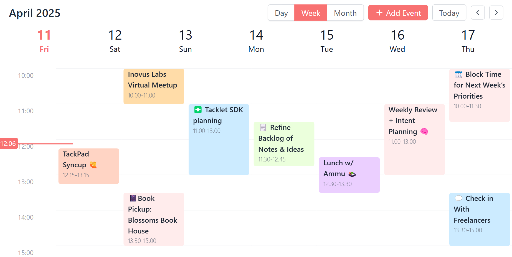

# TactiCal – Tackpad Tacklet

**TactiCal** is your strategic day planner inside Tackpad — a clean, minimal calendar widget designed for quick scheduling and organizing your day without the noise. It's purpose-built for creators, builders, and thinkers who want structure without friction.

---

## Features

- **Quick Scheduling** – Add events and blocks with just a click.
- **Multi-Day View** – Navigate days with a simple, intuitive layout.
- **Focused Layout** – Keeps your attention on the day ahead.
- **Tacklet Native** – Works seamlessly with other Tacklets in your canvas flow.

---

## Installation

TactiCal is built into Tackpad. No setup needed. Just add it from the Tacklet menu and start planning.

---

## Usage

1. Open **Tackpad** and open the Tacklet menu.  
2. Select **TactiCal** and drop it into your canvas.  
3. Click to create a new block of time.  
4. Fill in event details inline.  
5. Use multiple TactiCals to plan in parallel across themes or projects.

---

## Roadmap

- **Recurring Events** – Define tasks that repeat on your terms.  
- **Reminders & Alerts** – Gentle nudges to stay on track.  
- **Collab Mode** – Plan together with shared calendars.  
- **Keyboard Shortcuts** – Navigate and create at speed.

---

## Contributing

Got ideas to make TactiCal sharper? Open an issue, pitch a feature, or drop a PR. Tactical input always welcome.

---

## License

MIT License. See LICENSE for more details.